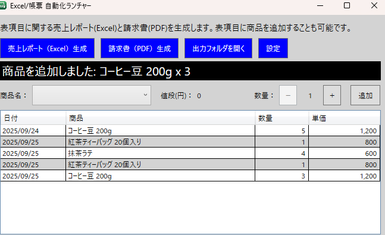
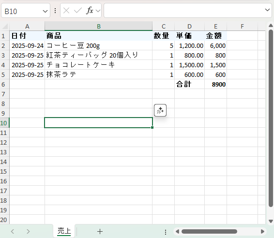
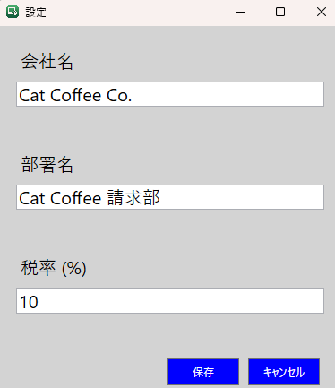
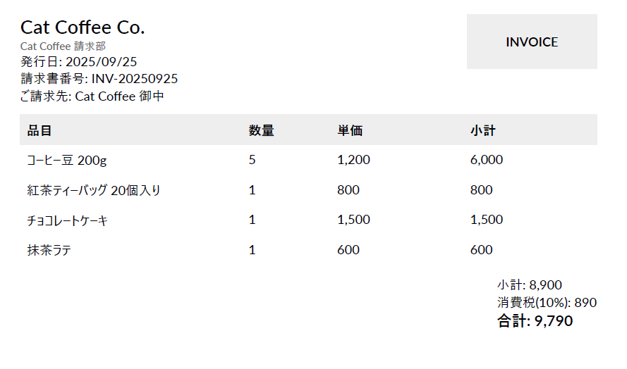

# 売上レポート・請求書出力アプリ

C#（.NET 8 / WPF）で開発したデスクトップアプリケーションです。  
画面上の売上一覧データをもとに、Excel 売上レポートおよび PDF 請求書を出力できます。

本アプリはポートフォリオ用のデモとして作成したものであり、業務アプリケーションを意識した帳票出力処理、設定ファイル運用、ログ出力を取り入れて実装しています。

---

## 画面イメージ

### メイン画面

売上一覧の確認、商品追加、Excel 出力、PDF 出力、設定画面表示を行う画面です。



### Excel 売上レポート

入力済みの売上データをもとに、Excel 形式の売上レポートを出力します。



### 設定画面

会社名、部署名、税率などの設定値を変更できます。  
設定値は `appsettings.json` と連動し、変更内容はアプリケーションに反映されます。



### PDF 請求書

売上一覧データをもとに、PDF 形式の請求書を生成します。



---

## 概要

本アプリは、売上データを一覧形式で入力し、帳票として出力することを想定した WPF アプリケーションです。

- DataGrid に入力した商品・数量・単価をもとに売上明細を管理
- ClosedXML を用いた Excel 売上レポートの生成
- QuestPDF を用いた PDF 請求書の生成
- `appsettings.json` の設定値に基づき、会社名・部署名・税率・商品マスタを反映
- `FileSystemWatcher` により設定ファイル変更を自動検知し、実行中アプリケーションへ即時反映
- `Serilog` によるログ出力に対応

---

## 主な機能

- 売上一覧の入力・編集
- Excel 売上レポート出力
- PDF 請求書出力
- 商品マスタの設定ファイル管理
- 設定ファイル変更のホットリロード
- 行ダブルクリック時の削除確認ダイアログ表示
- 出力処理および例外情報のログ記録

---

## 使用技術

- .NET 8 / WPF
- CommunityToolkit.MVVM
- ClosedXML
- QuestPDF
- Serilog / Serilog.Sinks.File
- FileSystemWatcher
- JSON 設定ファイル（`appsettings.json`）

---

## 推奨動作環境

### OS

- Windows 10 / Windows 11

### .NET ランタイム

- .NET 8 Desktop Runtime

### 開発環境

- Visual Studio 2022 以降

### ハードウェア

- CPU: Core i3 以上
- メモリ: 4GB 以上（推奨 8GB 以上）
- ストレージ: 500MB 以上の空き容量

---

## 出力ファイル

アプリケーション実行後、帳票およびログは `Output/` 配下に自動生成されます。

| 種別 | 出力先 | ファイル名 |
|------|--------|-----------|
| Excel レポート | `Output/SalesReport/` | `SalesReport_yyyyMMdd_HHmmss.xlsx` |
| PDF 請求書 | `Output/Invoice/` | `Invoice_INV-yyyyMMdd_HHmmss.pdf` |
| ログ | `Output/Log/` | `launcher.log` |

---

## 設定ファイル

設定値は `appsettings.json` で管理しています。  
会社名、部署名、税率、商品マスタなどを変更すると、アプリケーション実行中でも自動的に反映されます。

### 設定例

```json
{
  "CompanySettings": {
    "CompanyName": "Sample Company",
    "DepartmentName": "Sales Department",
    "TaxRate": 0.1
  },
  "Products": [
    { "Name": "商品A", "UnitPrice": 1000 },
    { "Name": "商品B", "UnitPrice": 2500 }
  ]
}
```

---

## ビルド手順

### 前提条件

- Windows 10 / 11
- Visual Studio 2022 以降
- .NET 8 SDK

### 手順

1. リポジトリをクローン

    ```bash
    git clone <リポジトリURL>
    ```

2. Visual Studio でソリューションを開く
3. NuGet パッケージを復元
4. Release / x64 でビルド
5. 出力された実行ファイルを起動

---

## 実行手順

1. アプリケーションを起動
2. 売上一覧に商品・数量・単価を入力
3. 必要に応じて `appsettings.json` を編集
4. Excel または PDF の出力機能を実行
5. `Output/` 配下に帳票ファイルが生成されることを確認

---

## 本アプリで確認できる内容

- WPF によるデスクトップ画面の実装
- MVVM を意識した画面ロジックの分離
- Excel / PDF 帳票出力機能の実装
- 設定ファイルを用いた運用しやすい構成
- ログ出力を含む保守性を意識した設計

---

## ライセンス

ポートフォリオ用途のサンプルアプリケーションです。  
利用ライブラリ（ClosedXML / QuestPDF / Serilog / CommunityToolkit.Mvvm など）のライセンスに従ってご利用ください。